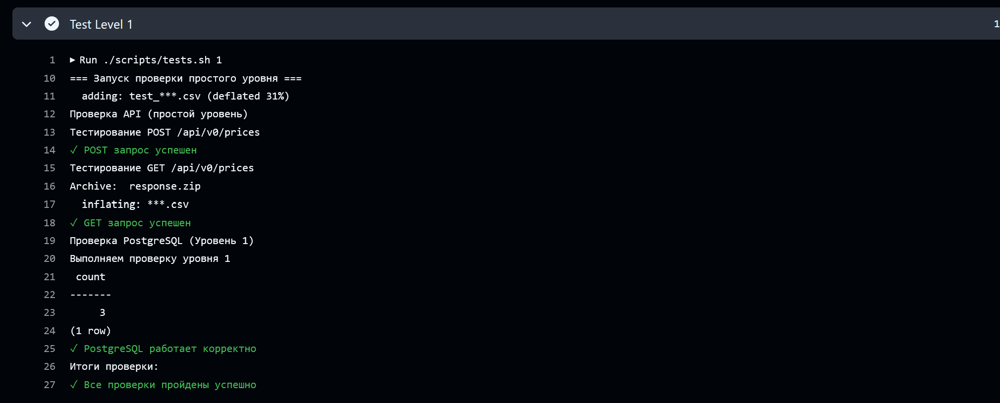
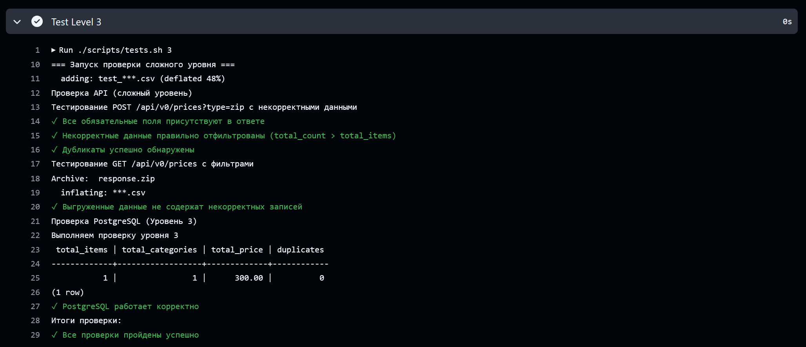

# Финальный проект 1 семестра

REST API сервис для загрузки и выгрузки данных о ценах.

## Требования к системе

Предварительно требуется добавить перменные окружения в файл `configs/.env` в соотвествии с шаблоном `configs/env.example`:
- Переменные разделов *Backend* и *Database* обязательны;
- Переменные разделов *Docker* и *Deploy* обязательны для запуска на удаленном сервере;

### Для локального запуска

- Go 1.25 или выше;
- Postgres 18 или выше;

### Для запуска с Docker

- Docker version 28;
- Docker Compose version v2;

### Для деплоя в Yandex Cloud:

- Установленный yc актуальной версии;
- Созданный профиль через yc init;
- Пара ssh-ключей для доступа к виртуальной машине;
- Аккаунт с доступом к ус
- jq актуальной версии;

## Установка и запуск

### Обязательные шаги

1. Склонировать репозиторий.
2. Настроить переменные окружения `configs/.env`.

### Установка и запуск локально

3. Создать пользователя и базу данных Postgres в соответствии с переменными окружения.
4. Выполнить установку зависимостей Go:
```
go mod vendor
```
5. Запустить приложение:
```
go run ./cmd/app/sem1-final-project-hard-level/main.go
```
6. Api будет доступно по адресу: `http://localhost:${PORT}/api/v0`

### Локальная установка с Docker

3. Установить актуальную версии Docker.
4. Выполнить сборку backend-сервиса c помощью скрипта:
```
scripts/prepare.sh
```
5. Выполнить сборку образов и запуск контейнеров:
```
sudo docker compose up --build -d
```
6. Api будет доступно по адресу: `http://localhost:${PORT}/api/v0`

Внимание! Конфигурация Docker Compose предусматривает отдельную установку БД Postres. При наличии ранее установленной БД, следует убедиться, что каждая БД будет использовать свой порт.

### Установка на удаленном сервере (Yandex Cloud)

Выполнить скрипт:
```
scripts/run.sh
```

При необходимости можно выполнить шаги отдельно:
- `scripts/helpers/create-infrastructure.sh` - установить необходимые ресурсы на удаленном сервере.
- `scripts/helpers/install-dependencies.sh` - установить зависимости (Docker).
- `scripts/helpers/deploy-application.sh` - развернуть приложение на удаленном сервере.

Внимание! При наличии ресурсов на удаленном сервере их переустановка не осуществляется.

## Тестирование

    ./scripts/tests.sh 1
    
    ./scripts/tests.sh 2
    
    ./scripts/tests.sh 3
    

## Контакт

Telegram: @cheshirskins